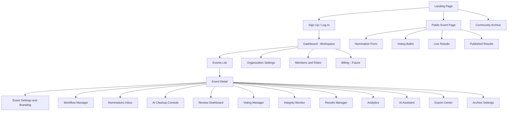
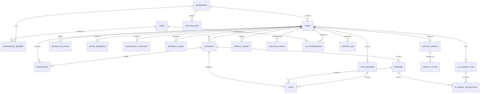

# AwardOS — Product Requirements Document (PRD)

**Version:** 1.0
**Date:** July 29, 2026
**Status:** Draft — Awaiting Review

---

## Table of Contents

1. [Executive Summary](#1-executive-summary)
2. [User Personas](#2-user-personas)
3. [User Stories](#3-user-stories)
4. [Information Architecture](#4-information-architecture)
5. [Functional Requirements](#5-functional-requirements)
6. [Data Models](#6-data-models)
7. [Non-Functional Requirements](#7-non-functional-requirements)
8. [Edge Cases & Error Handling](#8-edge-cases--error-handling)
9. [API Surface Overview](#9-api-surface-overview)
10. [Glossary](#10-glossary)

---

## 1. Executive Summary

### 1.1 Problem Statement

Organizers of recognition programs and award events currently rely on a fragmented toolkit of Google Forms, Excel spreadsheets, WhatsApp groups, and manual vote counting. This creates:

- **Data integrity risks** — duplicate nominations, inconsistent spelling, manual merge errors.
- **Coordination overhead** — organizers shuttle data between 4–7 tools per event.
- **Trust deficits** — opaque vote counting erodes participant confidence.
- **Lost institutional memory** — results live in private spreadsheets and are lost when organizers graduate or leave.

### 1.2 Solution

AwardOS is a unified, AI-assisted platform that manages every stage of an award event — from creation through nomination, review, voting, results management, and archival — in a single workspace.

### 1.3 MVP Scope

The MVP targets **university award nights and student organizations** while establishing an architecture extensible to corporate awards, hackathons, NGOs, churches, professional associations, sports awards, and community programs.

### 1.4 Success Metrics

| Metric | Target (6 months post-launch) |
|---|---|
| Events created | 200+ |
| Nominations processed | 10,000+ |
| Votes cast | 50,000+ |
| Average organizer setup time | < 30 minutes |
| Voting completion rate | > 75% |
| Organizer NPS | > 50 |
| AI merge suggestion accuracy | > 90% |

---

## 2. User Personas

### 2.1 The Event Organizer — "Ama"

| Attribute | Detail |
|---|---|
| **Role** | SRC President / Club Leader / Event Chair |
| **Age** | 20–28 |
| **Tech Comfort** | Moderate — comfortable with social media, Google Workspace, Canva |
| **Goals** | Run a credible, professional award night that the student body trusts and remembers |
| **Frustrations** | Spends 3–5 days cleaning nomination data in Excel; fielding WhatsApp complaints about vote legitimacy; coordinating a 6-person committee across multiple apps |
| **Motivations** | Wants to be seen as competent and organized; wants the event to enhance their organization's reputation |
| **Key Behaviors** | Creates the event, defines categories, manages the committee, reviews AI suggestions, publishes results |
| **Device** | Primarily mobile (Android), occasionally laptop |
| **Quote** | *"I want to click a button and have a clean ballot — not spend my weekend merging 'John Doe' and 'Jon Doe' in a spreadsheet."* |

### 2.2 The Committee Member — "Kwame"

| Attribute | Detail |
|---|---|
| **Role** | PRO / Secretary / Logistics Lead |
| **Age** | 19–26 |
| **Tech Comfort** | Moderate |
| **Goals** | Fulfill their committee role efficiently without being overwhelmed |
| **Frustrations** | Unclear responsibilities; being added to yet another WhatsApp group; not knowing what stage the event is in |
| **Motivations** | Wants clear tasks, wants to contribute visibly, wants recognition for their work |
| **Key Behaviors** | Receives an invite link, joins the workspace, performs assigned tasks (e.g., reviewing nominations, managing publicity), views event progress |
| **Device** | Mobile-first |
| **Quote** | *"Just tell me exactly what I need to do and when — I have exams next week."* |

### 2.3 The Judge / Reviewer — "Dr. Mensah"

| Attribute | Detail |
|---|---|
| **Role** | Faculty Judge / Industry Panel Member / External Reviewer |
| **Age** | 30–55 |
| **Tech Comfort** | Low to moderate — uses email and basic web apps |
| **Goals** | Evaluate nominees fairly and quickly, preferably from a single link |
| **Frustrations** | Receiving nominees in an unformatted email; unclear scoring criteria; no central place to submit scores |
| **Motivations** | Wants a professional, respectful experience befitting their status; wants to finish quickly |
| **Key Behaviors** | Receives a judging link, views nominee profiles, submits scores, optionally leaves comments |
| **Device** | Laptop or tablet |
| **Quote** | *"Send me one link. I'll score everyone and be done in 20 minutes."* |

### 2.4 The Nominee — "Efua"

| Attribute | Detail |
|---|---|
| **Role** | Nominated student / employee / community member |
| **Age** | 18–35 |
| **Tech Comfort** | High |
| **Goals** | Know that they've been nominated; optionally share the nomination to rally votes |
| **Frustrations** | Not knowing if their nomination was received; not being able to share their profile; opaque processes |
| **Motivations** | Recognition, social proof, shareable achievement |
| **Key Behaviors** | May or may not know about nomination until voting opens; shares voting link on social media; checks live results (if enabled) |
| **Device** | Mobile (primarily social media referral) |
| **Quote** | *"I want to share my nomination page on my Instagram story."* |

### 2.5 The Voter / Participant — "Kofi"

| Attribute | Detail |
|---|---|
| **Role** | Student / Public voter / Community member |
| **Age** | 17–40 |
| **Tech Comfort** | High |
| **Goals** | Cast a vote quickly and trust that it counts |
| **Frustrations** | Being forced to create an account; slow-loading forms; not knowing if their vote was recorded; suspecting vote rigging |
| **Motivations** | Supporting friends and deserving candidates; curiosity about results |
| **Key Behaviors** | Arrives via shared link (WhatsApp, Instagram, Twitter), votes across categories, shares the link with friends |
| **Device** | Mobile (90%+ of traffic) |
| **Quote** | *"I just want to vote and go — don't make me sign up for anything."* |

### 2.6 The Organization Admin — "Prof. Addo"

| Attribute | Detail |
|---|---|
| **Role** | Dean of Students / HR Director / Organization Head |
| **Age** | 35–60 |
| **Tech Comfort** | Low to moderate |
| **Goals** | Oversee multiple events under the organization's umbrella; maintain brand standards; access historical data |
| **Frustrations** | No visibility into how events are run; new student leaders reinventing processes every year |
| **Motivations** | Institutional continuity, quality control, accountability |
| **Key Behaviors** | Views organization dashboard, accesses archive, reviews analytics, transfers ownership when leadership changes |
| **Device** | Desktop / Laptop |
| **Quote** | *"Every year a new SRC starts from scratch. I want them to inherit last year's event as a template."* |

### 2.7 The Returning Participant — "Adwoa"

| Attribute | Detail |
|---|---|
| **Role** | Alumnus / Repeat voter / Past nominee |
| **Age** | 20–40 |
| **Tech Comfort** | High |
| **Goals** | View past events they participated in; get notified about new editions |
| **Frustrations** | No record of past nominations or awards; having to rediscover the platform each year |
| **Motivations** | Nostalgia, continued engagement, digital proof of achievements |
| **Key Behaviors** | Creates an optional account, browses archive, enables notifications, shares past achievements |
| **Device** | Mobile |
| **Quote** | *"I won Best Delegate in 2024 — where's my proof?"* |

---

## 3. User Stories

User stories are organized by feature area and prioritized using MoSCoW (Must / Should / Could / Won't for MVP).

### 3.1 Workspace & Account Management

| ID | As a... | I want to... | So that... | Priority |
|---|---|---|---|---|
| WS-01 | New user | sign up with email or Google SSO | I can start creating events immediately | Must |
| WS-02 | New user | start in a Personal Workspace by default | I don't have to set up an organization before creating my first event | Must |
| WS-03 | Organizer | invite collaborators by email or shareable link | my committee can join the workspace | Must |
| WS-04 | System | automatically upgrade a Personal Workspace to an Organization Workspace when the first collaborator joins | there is no migration friction | Must |
| WS-05 | Owner | assign roles (Admin, Event Manager, Judge, Secretary, PRO, Volunteer, etc.) to workspace members | responsibilities and permissions are clear | Must |
| WS-06 | Admin | create custom roles with granular permissions | I can model my organization's unique structure | Should |
| WS-07 | Owner | transfer workspace ownership to another member | leadership transitions (e.g., new SRC) are seamless | Must |
| WS-08 | Member | see a unified activity feed across all events in the workspace | I know what's happening without checking each event individually | Should |
| WS-09 | User | delete my account and have my personal data removed | I can exercise my data rights | Must |

### 3.2 Event Creation & Configuration

| ID | As a... | I want to... | So that... | Priority |
|---|---|---|---|---|
| EC-01 | Organizer | create a new Event with a name, description, banner, and timeline | the event has a public identity | Must |
| EC-02 | Organizer | define award categories with names, descriptions, and optional eligibility rules | nominees and voters understand each category | Must |
| EC-03 | Organizer | duplicate a past Event as a template | I don't repeat configuration work every year | Must |
| EC-04 | Organizer | configure the event workflow by reordering, adding, or removing stages | the event matches my organization's process | Must |
| EC-05 | Organizer | upload branding assets (logo, banner, flyer, background, color palette) | the event reflects my organization's identity | Must |
| EC-06 | Organizer | set event visibility (public, unlisted, private) | I control who can discover the event | Must |
| EC-07 | Organizer | configure a social sharing preview image and text | links shared on WhatsApp / Twitter / Instagram look professional | Should |
| EC-08 | Organizer | set start and end dates for each workflow stage independently | each phase opens and closes automatically | Must |
| EC-09 | Organizer | ask the AI assistant to generate category suggestions based on my event type | I have a good starting point without creating categories from scratch | Should |
| EC-10 | Organizer | preview my event's public page before publishing | I can catch errors before participants see them | Must |

### 3.3 Nomination Phase

| ID | As a... | I want to... | So that... | Priority |
|---|---|---|---|---|
| NM-01 | Participant | nominate candidates without creating an account | participation is frictionless | Must |
| NM-02 | Participant | nominate candidates across multiple categories in a single session | I don't have to submit multiple forms | Must |
| NM-03 | Participant | submit a correction by filling a new nomination form | my latest submission reflects my true intent | Must |
| NM-04 | System | remember my previous submissions in local browser storage | I can see what I already submitted if I return | Should |
| NM-05 | Participant | suggest entirely new award categories | the event can capture categories organizers didn't anticipate | Should |
| NM-06 | Organizer | view a Suggested Categories Inbox | I can review, rename, merge, approve, or reject participant-suggested categories | Should |
| NM-07 | Organizer | see a real-time count of nominations per category | I can track engagement as nominations come in | Must |
| NM-08 | Organizer | close nominations manually or let them close automatically at a scheduled time | I control the nomination window | Must |
| NM-09 | Organizer | add eligibility requirements to nomination forms (e.g., department, year group) | only qualified candidates are nominated | Should |
| NM-10 | Participant | see a confirmation screen after submitting my nominations | I know my submission was received | Must |

### 3.4 AI Nomination Cleanup

| ID | As a... | I want to... | So that... | Priority |
|---|---|---|---|---|
| AI-01 | System | automatically remove blank / empty nomination responses after nominations close | organizers don't waste time on junk data | Must |
| AI-02 | System | detect duplicate nominees (same person, different spellings) and present them with confidence scores | organizers can merge records efficiently | Must |
| AI-03 | System | normalize capitalization across all nominee names | data is consistently formatted | Must |
| AI-04 | System | detect nickname variations (e.g., "Mike" / "Michael") and suggest merges | no nominee is split across two records | Must |
| AI-05 | Organizer | see a side-by-side review interface for AI-suggested merges | I can approve or reject each suggestion individually | Must |
| AI-06 | Organizer | batch-approve or batch-reject AI suggestions | I can process large volumes efficiently | Should |
| AI-07 | System | never auto-merge nominees without explicit organizer approval | organizers retain final authority over data | Must |
| AI-08 | Organizer | see an "uncertain matches" section for low-confidence suggestions | edge cases are surfaced rather than hidden | Should |
| AI-09 | Organizer | undo a merge action | mistakes during review can be reversed | Must |

### 3.5 Review Dashboard

| ID | As a... | I want to... | So that... | Priority |
|---|---|---|---|---|
| RD-01 | Organizer | add, remove, merge, rename, and reorder nominees within each category | the ballot reflects the correct candidates | Must |
| RD-02 | Organizer | add, remove, rename, and reorder categories | the ballot structure is correct | Must |
| RD-03 | Organizer | move a nominee from one category to another | misclassified nominations are corrected | Should |
| RD-04 | Organizer | generate a voting ballot from the reviewed nominations with one click | the transition from review to voting is seamless | Must |
| RD-05 | Organizer | create a voting ballot entirely from scratch (without nominations) | events that skip the nomination phase are supported | Must |
| RD-06 | Organizer | preview the voting ballot as a participant would see it | I can verify the voter experience before going live | Must |
| RD-07 | Organizer | attach a photo, bio, or description to each nominee | voters have context when casting their votes | Could |

### 3.6 Voting Phase

| ID | As a... | I want to... | So that... | Priority |
|---|---|---|---|---|
| VT-01 | Voter | cast votes without creating an account | participation is frictionless | Must |
| VT-02 | Voter | vote on each category independently, with the option to skip | I'm not forced to vote in categories I don't care about | Must |
| VT-03 | Voter | see a confirmation summary of my votes (including skipped categories) before final submission | I can catch mistakes | Must |
| VT-04 | System | make votes final and immutable after submission | the integrity of voting is maintained | Must |
| VT-05 | Voter | receive a confirmation receipt (on-screen and optionally via email) after voting | I have proof that my vote was recorded | Must |
| VT-06 | Organizer | choose a verification level (Standard or Advanced) for the event | I can balance accessibility with integrity | Must |
| VT-07 | Organizer | configure audience eligibility (Public, Students Only, Faculty, Alumni, Invite-Only, Members) | only authorized people can vote | Must |
| VT-08 | Organizer | set voting start and end times that activate and deactivate automatically | I don't have to manually open/close voting | Must |
| VT-09 | Organizer | extend or shorten the voting window while voting is active | I can respond to real-world circumstances | Should |
| VT-10 | System | enforce one-vote-per-person using the configured verification method | vote integrity is protected | Must |
| VT-11 | Voter | see a "Thank you" page with social sharing options after voting | I can encourage friends to vote too | Should |

### 3.7 Verification

| ID | As a... | I want to... | So that... | Priority |
|---|---|---|---|---|
| VR-01 | System | prevent duplicate votes using cookies + browser storage + IP rate limiting + device fingerprinting (Standard level) | casual fraud is deterred | Must |
| VR-02 | Organizer | require institutional email OTP verification (Advanced level) | only verified community members can vote | Should |
| VR-03 | Organizer | whitelist specific email domains (e.g., `@university.edu.gh`) | only students from the correct institution can vote | Should |
| VR-04 | Organizer | distribute single-use invitation codes | voting is limited to a known participant list | Should |
| VR-05 | Organizer | combine multiple verification methods on a single event | I can layer security as needed | Could |

### 3.8 Live Results & Transparency

| ID | As a... | I want to... | So that... | Priority |
|---|---|---|---|---|
| LR-01 | Organizer | choose live result visibility: Hidden / Rankings Only / Percentages Only / Vote Counts / Full Leaderboard | I control how much the public sees during voting | Must |
| LR-02 | Voter | see live results (when enabled) without re-entering the voting flow | I can check standings without risking a duplicate vote | Should |
| LR-03 | Organizer | change live result visibility at any time during the event | I can adapt to circumstances (e.g., hide results if manipulation is suspected) | Should |

### 3.9 AI Event Assistant

| ID | As a... | I want to... | So that... | Priority |
|---|---|---|---|---|
| AA-01 | Organizer | ask the AI assistant to generate award category suggestions | I have a strong starting point | Should |
| AA-02 | Organizer | ask the AI assistant to write an event description | I save time on copywriting | Should |
| AA-03 | Organizer | ask the AI assistant to draft social media posts (Twitter, Instagram, WhatsApp) | publicity is faster | Should |
| AA-04 | Organizer | ask the AI assistant to generate an MC/host script for the award night | event-night preparation is easier | Could |
| AA-05 | Organizer | ask the AI assistant to draft a sponsorship proposal | fundraising is streamlined | Could |
| AA-06 | Organizer | ask the AI assistant to summarize nominations or voting data | I get quick insights without reading raw data | Should |
| AA-07 | Organizer | have the AI assistant understand the context of my specific event | responses are relevant, not generic | Must |

### 3.10 AI Integrity Monitoring

| ID | As a... | I want to... | So that... | Priority |
|---|---|---|---|---|
| IM-01 | System | monitor for voting spikes (sudden surge from a single source) | manipulation attempts are flagged | Must |
| IM-02 | System | detect duplicate browser / device fingerprints attempting multiple votes | technical fraud is surfaced | Must |
| IM-03 | System | flag suspicious IP patterns (e.g., 50+ votes from one IP in 10 minutes) | organized fraud is detected | Must |
| IM-04 | System | detect bot-like voting behavior (e.g., uniform timing, no scroll events) | automated voting is flagged | Should |
| IM-05 | Organizer | receive integrity alerts with recommendations (not automatic actions) | I decide how to respond to threats | Must |
| IM-06 | Organizer | view an Integrity Dashboard showing all flagged activity | I have a centralized security view | Should |

### 3.11 Results Management

| ID | As a... | I want to... | So that... | Priority |
|---|---|---|---|---|
| RM-01 | System | preserve raw nomination and voting data immutably | there is always an audit trail | Must |
| RM-02 | Organizer | create Official Results by editing a copy of raw results | I can apply corrections without destroying original data | Must |
| RM-03 | Organizer | disqualify a nominee with an optional explanation | fraudulent or ineligible nominees are removed transparently | Must |
| RM-04 | Organizer | override a ranking with an optional explanation | judges' decisions or administrative corrections are documented | Must |
| RM-05 | Organizer | create special recognition / contribution awards that weren't part of voting | additional achievements are honored | Should |
| RM-06 | Organizer | publish Official Results to the public event page | the community sees the final outcomes | Must |
| RM-07 | Organizer | unpublish results if an error is discovered post-publication | mistakes can be corrected | Must |

### 3.12 Analytics & Insights

| ID | As a... | I want to... | So that... | Priority |
|---|---|---|---|---|
| AN-01 | Organizer | see participation metrics (total nominations, total votes, completion rate) | I understand engagement levels | Must |
| AN-02 | Organizer | see category-level analytics (most popular categories, most nominated individuals) | I understand what resonates | Must |
| AN-03 | Organizer | see traffic source breakdowns (WhatsApp, Instagram, Twitter, direct) | I know which channels drive participation | Should |
| AN-04 | Organizer | see participation segmented by department / faculty / organization (where data is available) | I understand demographic engagement | Should |
| AN-05 | Organizer | receive AI-generated insights (e.g., "Category X had 3× more nominations than last year") | I get actionable intelligence without manual analysis | Could |
| AN-06 | Organizer | see a suspicious voting score per category | I can prioritize integrity review | Should |

### 3.13 Community Archive

| ID | As a... | I want to... | So that... | Priority |
|---|---|---|---|---|
| CA-01 | Organizer | configure which event data is publicly archived (winners, nominees, categories, statistics) | privacy is respected | Must |
| CA-02 | Public visitor | browse archived events and see winners | recognition is permanent and discoverable | Must |
| CA-03 | Returning participant | find events I participated in and see my recognition history | I have a digital record of my achievements | Should |
| CA-04 | Organizer | upload photos and highlights to the event archive | the archive is rich and celebratory | Could |

### 3.14 Exporting

| ID | As a... | I want to... | So that... | Priority |
|---|---|---|---|---|
| EX-01 | Organizer | export nomination data as Excel (.xlsx) or CSV | I can share data with stakeholders who need spreadsheets | Must |
| EX-02 | Organizer | export voting results as Excel (.xlsx) or CSV | I have portable copies of results | Must |
| EX-03 | Organizer | export a print-ready PDF results report | I can present results at the award ceremony | Should |
| EX-04 | Organizer | export analytics dashboards as PDF | I can include them in post-event reports to sponsors/administration | Should |

---

## 4. Information Architecture

### 4.1 Navigation Map

### 4.2 Public vs. Authenticated Views

| View | Auth Required? | Description |
|---|---|---|
| Event Landing Page | No | Branding, description, timeline, current stage |
| Nomination Form | No | Submit nominations as guest |
| Voting Ballot | No (verification may apply) | Cast votes as guest |
| Live Results | No | View results (if organizer enables) |
| Published Results | No | View final winners |
| Community Archive | No | Browse past events |
| Organizer Dashboard | Yes | Manage events, team, settings |
| AI Assistant | Yes | Contextual AI help for organizers |
| Analytics | Yes | Event insights and metrics |
| Integrity Monitor | Yes | Security and fraud detection |

---

## 5. Functional Requirements

### 5.1 Authentication & Identity

| ID | Requirement | Details |
|---|---|---|
| FR-AUTH-01 | Email + password registration | Standard registration with email verification |
| FR-AUTH-02 | Google SSO | OAuth 2.0 integration for one-click sign-up/sign-in |
| FR-AUTH-03 | Session management | JWT or session-based auth with refresh tokens; 30-day session persistence |
| FR-AUTH-04 | Password reset | Email-based password reset flow |
| FR-AUTH-05 | Guest identity | Anonymous participants identified by browser fingerprint + session token; no account required |
| FR-AUTH-06 | Account deletion | Full PII removal within 30 days of request; anonymize linked records |

### 5.2 Workspace Management

| ID | Requirement | Details |
|---|---|---|
| FR-WS-01 | Personal Workspace auto-creation | Created on first sign-up; single-owner |
| FR-WS-02 | Organization Workspace upgrade | Triggered when first collaborator accepts invite; no data migration needed — same workspace ID, new type flag |
| FR-WS-03 | Role-based access control (RBAC) | Built-in roles: Owner, Administrator, Event Manager, Judge, Reviewer, Secretary, PRO, Volunteer. Permissions matrix governs access to every feature |
| FR-WS-04 | Custom roles | Admins can create roles with custom permission sets selected from the global permission catalogue |
| FR-WS-05 | Invite system | Invite via email (sends magic link) or shareable join link (with optional expiry and role assignment) |
| FR-WS-06 | Ownership transfer | Owner can transfer to any Admin; requires confirmation from both parties |
| FR-WS-07 | Member removal | Admins can remove members; removed members lose all workspace access but retain their personal accounts |
| FR-WS-08 | Activity audit log | All workspace-level actions logged with actor, timestamp, and action type; visible to Owner and Admin |

#### 5.2.1 Permissions Matrix (Built-in Roles)

| Permission | Owner | Admin | Event Manager | Judge | Reviewer | Secretary | PRO | Volunteer |
|---|---|---|---|---|---|---|---|---|
| Manage workspace settings | ✅ | ✅ | ❌ | ❌ | ❌ | ❌ | ❌ | ❌ |
| Invite / remove members | ✅ | ✅ | ❌ | ❌ | ❌ | ❌ | ❌ | ❌ |
| Assign roles | ✅ | ✅ | ❌ | ❌ | ❌ | ❌ | ❌ | ❌ |
| Create events | ✅ | ✅ | ✅ | ❌ | ❌ | ❌ | ❌ | ❌ |
| Edit event settings | ✅ | ✅ | ✅ | ❌ | ❌ | ❌ | ❌ | ❌ |
| Manage nominations | ✅ | ✅ | ✅ | ❌ | ✅ | ✅ | ❌ | ❌ |
| Review AI suggestions | ✅ | ✅ | ✅ | ❌ | ✅ | ❌ | ❌ | ❌ |
| Manage voting | ✅ | ✅ | ✅ | ❌ | ❌ | ❌ | ❌ | ❌ |
| Submit judge scores | ❌ | ❌ | ❌ | ✅ | ❌ | ❌ | ❌ | ❌ |
| View analytics | ✅ | ✅ | ✅ | ❌ | ❌ | ✅ | ✅ | ❌ |
| View integrity monitor | ✅ | ✅ | ✅ | ❌ | ❌ | ❌ | ❌ | ❌ |
| Manage results | ✅ | ✅ | ✅ | ❌ | ❌ | ❌ | ❌ | ❌ |
| Publish results | ✅ | ✅ | ❌ | ❌ | ❌ | ❌ | ❌ | ❌ |
| Export data | ✅ | ✅ | ✅ | ❌ | ❌ | ✅ | ❌ | ❌ |
| Use AI assistant | ✅ | ✅ | ✅ | ❌ | ❌ | ✅ | ✅ | ❌ |
| Manage archive settings | ✅ | ✅ | ❌ | ❌ | ❌ | ❌ | ❌ | ❌ |

### 5.3 Event Creation & Configuration

| ID | Requirement | Details |
|---|---|---|
| FR-EV-01 | Unlimited event creation | No artificial cap on events per workspace |
| FR-EV-02 | Event metadata | Name (required), description (rich text), banner image, timeline summary |
| FR-EV-03 | Category management | CRUD operations on categories; each category has: name, description, eligibility rules (optional), max nominees per voter (default 1), display order |
| FR-EV-04 | Workflow configuration | Default 6-stage pipeline; organizer can add/remove/reorder stages from a stage library |
| FR-EV-05 | Stage scheduling | Each stage has optional start/end datetime; auto-transition when end time passes |
| FR-EV-06 | Event duplication | Deep-copy event config (categories, workflow, branding, settings) into a new draft event |
| FR-EV-07 | Branding uploads | Accept PNG/JPG/WebP; max 5 MB per image; auto-resize for different contexts (thumbnail, banner, OG image) |
| FR-EV-08 | Color palette picker | Primary, secondary, accent colors; live preview in event page |
| FR-EV-09 | Visibility settings | Public (discoverable), Unlisted (link-only), Private (invite-only) |
| FR-EV-10 | Event status lifecycle | Draft → Active → Completed → Archived |
| FR-EV-11 | Event deletion | Soft-delete with 30-day recovery window; permanent delete after |

### 5.4 Nomination System

| ID | Requirement | Details |
|---|---|---|
| FR-NOM-01 | Guest nomination form | Rendered from event categories; no auth required |
| FR-NOM-02 | Multi-category submission | Single form covers all categories; participant fills in one or more |
| FR-NOM-03 | Re-submission support | Same participant can submit again; system links submissions by session/fingerprint; organizer sees all versions |
| FR-NOM-04 | Local persistence | Store last submission in `localStorage`; restore on revisit with "Your previous submission" banner |
| FR-NOM-05 | Suggested categories | Separate input field for free-text category suggestions; stored independently from nominations |
| FR-NOM-06 | Suggested Categories Inbox | Dashboard showing all suggestions, grouped by similarity; actions: Approve, Reject, Rename, Merge |
| FR-NOM-07 | Real-time nomination counter | WebSocket or polling-based live count per category on organizer dashboard |
| FR-NOM-08 | Nomination schedule | Auto-open and auto-close at configured times; manual override available |
| FR-NOM-09 | Confirmation UI | Success screen with submitted data summary; optional "share this event" CTA |
| FR-NOM-10 | Nomination form preview | Organizer can preview the form exactly as participants will see it |

### 5.5 AI Nomination Cleanup

| ID | Requirement | Details |
|---|---|---|
| FR-AI-01 | Blank removal | Remove entries where nominee name is empty, whitespace-only, or contains only special characters |
| FR-AI-02 | Duplicate detection | Use fuzzy string matching (Levenshtein distance, Jaro-Winkler, phonetic encoding) to identify likely duplicates |
| FR-AI-03 | Capitalization normalization | Convert all names to Title Case; handle edge cases (van, de, O', Mc, Mac) |
| FR-AI-04 | Nickname detection | Maintain a nickname dictionary + LLM-based inference for uncommon nicknames |
| FR-AI-05 | Confidence scoring | Each merge suggestion scored 0–100; thresholds: High (≥85), Medium (60–84), Low (<60) |
| FR-AI-06 | Review interface | Side-by-side display: left = original records, right = suggested merged record; approve/reject/edit per suggestion |
| FR-AI-07 | Batch operations | Select multiple suggestions → bulk approve or bulk reject |
| FR-AI-08 | Merge undo | Merged records can be unmerged within the review phase; undo restores original separate records |
| FR-AI-09 | Cleanup audit trail | Every AI suggestion and organizer decision logged with timestamp |
| FR-AI-10 | Manual trigger | Cleanup runs on-demand (button click); does not run automatically to avoid surprising organizers |

### 5.6 Voting System

| ID | Requirement | Details |
|---|---|---|
| FR-VOT-01 | Guest voting | Default; no account required; identity established by verification method |
| FR-VOT-02 | Per-category voting | Each category is an independent voting unit; voter selects one nominee (or skips) |
| FR-VOT-03 | Skip functionality | Each category has an explicit "Skip" option; skipped categories do not count as votes |
| FR-VOT-04 | Confirmation page | Pre-submission review showing all selections and highlighting skipped categories with visual distinction |
| FR-VOT-05 | Vote immutability | After submission, votes are write-once; no edit/delete by voter |
| FR-VOT-06 | Vote recording | Each vote stored with: voter identity token (hashed), timestamp, category ID, nominee ID, verification metadata |
| FR-VOT-07 | Rate limiting | Max 3 vote submission attempts per identity per hour (prevents accidental double-clicks and intentional flooding) |
| FR-VOT-08 | Graceful deadline handling | Voters who started the ballot before the deadline can complete submission within a 15-minute grace window |

### 5.7 Verification System

| ID | Requirement | Details |
|---|---|---|
| FR-VER-01 | Standard verification | Cookie + localStorage flag + IP rate limiting (configurable: N votes per IP per time window) + device fingerprint (canvas, WebGL, timezone, screen resolution) |
| FR-VER-02 | Advanced: Email OTP | Send 6-digit OTP to provided email; 5-minute expiry; max 3 resend attempts |
| FR-VER-03 | Advanced: Domain whitelist | Validate email domain against organizer-defined list (e.g., `@ashesi.edu.gh`, `@company.com`) |
| FR-VER-04 | Advanced: Invitation codes | Organizer generates N single-use codes; voter enters code before accessing ballot; used codes invalidated |
| FR-VER-05 | Per-event configuration | Verification method set during event creation; changeable before voting opens; locked once first vote is cast |
| FR-VER-06 | Verification failure handling | Clear error messages; rate limit after 5 consecutive failures; 30-minute cooldown |

### 5.8 Live Results

| ID | Requirement | Details |
|---|---|---|
| FR-LR-01 | Visibility modes | Off (default) / Rankings Only / Percentages / Vote Counts / Full Leaderboard |
| FR-LR-02 | Real-time updates | Results refresh via WebSocket or Server-Sent Events; max 5-second latency |
| FR-LR-03 | Dynamic toggle | Organizer can change visibility mode at any time; takes effect immediately |
| FR-LR-04 | Public results page | Standalone URL (no auth) showing results in the configured mode; respects event branding |

### 5.9 AI Event Assistant

| ID | Requirement | Details |
|---|---|---|
| FR-AA-01 | Contextual awareness | Assistant has access to the event's metadata, categories, nominations (aggregated), voting stats, workflow state |
| FR-AA-02 | Content generation | Supports: event descriptions, social media posts, MC scripts, sponsorship proposals, eligibility rules, email campaigns |
| FR-AA-03 | Data summarization | Can summarize nominations, voting trends, participation metrics in natural language |
| FR-AA-04 | Conversational interface | Chat-based UI embedded in the event dashboard; supports follow-up questions |
| FR-AA-05 | Output actions | Generated content can be: copied to clipboard, inserted into event fields, exported as text/PDF |
| FR-AA-06 | Rate limiting | Max 50 assistant interactions per event per day (MVP) |

### 5.10 AI Integrity Monitoring

| ID | Requirement | Details |
|---|---|---|
| FR-IM-01 | Spike detection | Flag when vote rate exceeds 3x the rolling average within a 10-minute window |
| FR-IM-02 | Fingerprint analysis | Flag when multiple votes share identical device fingerprints |
| FR-IM-03 | IP clustering | Flag when a single IP or /24 subnet exceeds configured threshold |
| FR-IM-04 | Bot detection | Analyze timing patterns, mouse/touch events, scroll behavior; flag uniform/mechanical patterns |
| FR-IM-05 | Alert system | Alerts categorized as: Info / Warning / Critical; delivered via in-app notification + optional email to admins |
| FR-IM-06 | Integrity dashboard | Unified view of all alerts with filtering, sorting, and detailed drill-down per alert |
| FR-IM-07 | No automatic action | System never blocks voters or discards votes without organizer approval |
| FR-IM-08 | Per-category integrity score | 0–100 score combining all signals; displayed on results dashboard |

### 5.11 Results Management

| ID | Requirement | Details |
|---|---|---|
| FR-RM-01 | Raw results preservation | Immutable snapshot of all votes; cannot be edited or deleted; serves as audit trail |
| FR-RM-02 | Official results layer | Editable copy of raw results; supports: disqualifications, ranking overrides, vote removal, special awards |
| FR-RM-03 | Action audit trail | Every edit to official results logged with: actor, timestamp, action, optional explanation |
| FR-RM-04 | Publication flow | Official Results → Review Preview → Confirm Publish → Published Results |
| FR-RM-05 | Unpublish capability | Published results can be retracted; event page shows "Results under review" message |
| FR-RM-06 | Special awards | Create awards outside the voting process (e.g., "Lifetime Achievement") with custom nominee and description |

### 5.12 Analytics

| ID | Requirement | Details |
|---|---|---|
| FR-AN-01 | Participation overview | Total nominations, total votes, unique voters, completion rate (votes submitted / votes started) |
| FR-AN-02 | Category analytics | Per-category: nomination count, vote count, vote distribution, top nominees |
| FR-AN-03 | Engagement timeline | Time-series chart of nominations and votes over the event lifecycle |
| FR-AN-04 | Traffic sources | UTM parameter tracking + referrer analysis; breakdown by source (social, direct, email) |
| FR-AN-05 | Demographic segmentation | If eligibility data is collected: breakdowns by department, year group, faculty |
| FR-AN-06 | Comparative analytics | If previous event exists: year-over-year comparison of key metrics |

### 5.13 Community Archive

| ID | Requirement | Details |
|---|---|---|
| FR-CA-01 | Auto-archive on completion | Events automatically move to archive after results are published |
| FR-CA-02 | Privacy configuration | Organizer selects what to include: winners only / all nominees / statistics / organizer names / photos |
| FR-CA-03 | Public archive page | Browsable, searchable list of archived events under the organization |
| FR-CA-04 | Individual event archive page | Winners, categories, highlights, and statistics for a single event |
| FR-CA-05 | Permanence | Archived events persist indefinitely; deletion requires Owner + Admin confirmation |

### 5.14 Exporting

| ID | Requirement | Details |
|---|---|---|
| FR-EX-01 | Data export formats | Excel (.xlsx), CSV |
| FR-EX-02 | Report export formats | PDF (formatted), Print-optimized HTML |
| FR-EX-03 | Exportable datasets | Nominations (raw), nominations (cleaned), voting results (raw), official results, analytics summary |
| FR-EX-04 | Export access control | Only roles with export permission can trigger exports |
| FR-EX-05 | Async export for large datasets | Exports > 10,000 rows processed in background; download link sent via notification |

---

## 6. Data Models

### 6.1 Entity Relationship Diagram

### 6.2 Core Entities

#### User

| Field | Type | Constraints |
|---|---|---|
| id | UUID | PK |
| email | String | UNIQUE, NOT NULL |
| password_hash | String | NULL (if SSO only) |
| display_name | String | NOT NULL |
| avatar_url | String | NULL |
| auth_provider | Enum | EMAIL, GOOGLE |
| email_verified | Boolean | DEFAULT false |
| created_at | DateTime | NOT NULL |
| updated_at | DateTime | NOT NULL |
| deleted_at | DateTime | NULL (soft delete) |

#### Workspace

| Field | Type | Constraints |
|---|---|---|
| id | UUID | PK |
| name | String | NOT NULL |
| slug | String | UNIQUE, NOT NULL |
| type | Enum | PERSONAL, ORGANIZATION |
| logo_url | String | NULL |
| description | String | NULL |
| created_by | UUID | FK → User |
| created_at | DateTime | NOT NULL |
| updated_at | DateTime | NOT NULL |

#### WorkspaceMember

| Field | Type | Constraints |
|---|---|---|
| id | UUID | PK |
| workspace_id | UUID | FK → Workspace |
| user_id | UUID | FK → User |
| role | Enum | OWNER, ADMIN, EVENT_MANAGER, JUDGE, REVIEWER, SECRETARY, PRO, VOLUNTEER |
| custom_role_id | UUID | FK → CustomRole, NULL if built-in role |
| invited_by | UUID | FK → User |
| invited_at | DateTime | NOT NULL |
| accepted_at | DateTime | NULL |
| status | Enum | PENDING, ACTIVE, REMOVED |
| | | UNIQUE(workspace_id, user_id) |

#### CustomRole

| Field | Type | Constraints |
|---|---|---|
| id | UUID | PK |
| workspace_id | UUID | FK → Workspace |
| name | String | NOT NULL |
| permissions | JSON | NOT NULL — Array of permission keys |
| created_by | UUID | FK → User |
| created_at | DateTime | NOT NULL |
| | | UNIQUE(workspace_id, name) |

#### Event

| Field | Type | Constraints |
|---|---|---|
| id | UUID | PK |
| workspace_id | UUID | FK → Workspace |
| name | String | NOT NULL |
| slug | String | NOT NULL |
| description | Text | NULL |
| status | Enum | DRAFT, ACTIVE, COMPLETED, ARCHIVED |
| visibility | Enum | PUBLIC, UNLISTED, PRIVATE |
| verification_level | Enum | STANDARD, ADVANCED |
| verification_config | JSON | NOT NULL, DEFAULT '{}' |
| audience_type | Enum | PUBLIC, STUDENTS, FACULTY, ALUMNI, INVITE_ONLY, MEMBERS |
| audience_config | JSON | NOT NULL, DEFAULT '{}' |
| live_results_mode | Enum | HIDDEN, RANKINGS, PERCENTAGES, VOTE_COUNTS, FULL_LEADERBOARD |
| duplicated_from | UUID | FK → Event, NULL |
| created_by | UUID | FK → User |
| created_at | DateTime | NOT NULL |
| updated_at | DateTime | NOT NULL |
| deleted_at | DateTime | NULL (soft delete) |
| | | UNIQUE(workspace_id, slug) |

> [!NOTE]
> The `verification_config` JSON stores method-specific settings. Example: `{ "methods": ["EMAIL_OTP"], "allowed_domains": ["@uni.edu"], "ip_rate_limit": 5, "ip_rate_window_minutes": 60 }`

#### EventBranding

| Field | Type | Constraints |
|---|---|---|
| id | UUID | PK |
| event_id | UUID | FK → Event, UNIQUE |
| logo_url | String | NULL |
| banner_url | String | NULL |
| flyer_url | String | NULL |
| background_url | String | NULL |
| og_image_url | String | NULL — Social sharing preview |
| primary_color | String | NULL — Hex code |
| secondary_color | String | NULL |
| accent_color | String | NULL |
| updated_at | DateTime | NOT NULL |

#### WorkflowStage

| Field | Type | Constraints |
|---|---|---|
| id | UUID | PK |
| event_id | UUID | FK → Event |
| stage_type | Enum | CREATION, NOMINATIONS, SCREENING, VERIFICATION, ADMIN_REVIEW, COMMITTEE_REVIEW, JUDGES_SCORING, INTERVIEWS, SPONSOR_APPROVAL, FINAL_REVIEW, VOTING, OFFICIAL_RESULTS, COMMUNITY_ARCHIVE |
| display_name | String | NOT NULL |
| display_order | Integer | NOT NULL |
| status | Enum | PENDING, ACTIVE, COMPLETED, SKIPPED |
| starts_at | DateTime | NULL |
| ends_at | DateTime | NULL |
| auto_transition | Boolean | DEFAULT true |
| config | JSON | DEFAULT '{}' |
| | | UNIQUE(event_id, display_order) |

#### Category

| Field | Type | Constraints |
|---|---|---|
| id | UUID | PK |
| event_id | UUID | FK → Event |
| name | String | NOT NULL |
| description | Text | NULL |
| eligibility | Text | NULL — Free-text rules |
| display_order | Integer | NOT NULL |
| max_nominees_per_voter | Integer | DEFAULT 1 |
| is_active | Boolean | DEFAULT true |
| created_at | DateTime | NOT NULL |
| updated_at | DateTime | NOT NULL |
| | | UNIQUE(event_id, name) |

#### Nominee

| Field | Type | Constraints |
|---|---|---|
| id | UUID | PK |
| event_id | UUID | FK → Event |
| category_id | UUID | FK → Category |
| name | String | NOT NULL |
| normalized_name | String | NOT NULL — Lowercase, trimmed |
| photo_url | String | NULL |
| bio | Text | NULL |
| display_order | Integer | NOT NULL |
| status | Enum | ACTIVE, MERGED, DISQUALIFIED, REMOVED |
| merged_into | UUID | FK → Nominee, NULL |
| source | Enum | NOMINATION, MANUAL, AI_SUGGESTED |
| nomination_count | Integer | DEFAULT 0 — Denormalized counter |
| created_at | DateTime | NOT NULL |
| updated_at | DateTime | NOT NULL |

#### Nomination

| Field | Type | Constraints |
|---|---|---|
| id | UUID | PK |
| event_id | UUID | FK → Event |
| category_id | UUID | FK → Category |
| nominee_text | String | NOT NULL — Raw text submitted |
| resolved_nominee_id | UUID | FK → Nominee, NULL until resolved |
| session_id | String | NOT NULL |
| device_fingerprint | String | NULL |
| ip_address | String | NULL — Hashed for privacy |
| user_agent | String | NULL |
| submission_number | Integer | DEFAULT 1 |
| is_latest | Boolean | DEFAULT true |
| created_at | DateTime | NOT NULL |

#### SuggestedCategory

| Field | Type | Constraints |
|---|---|---|
| id | UUID | PK |
| event_id | UUID | FK → Event |
| suggestion_text | String | NOT NULL |
| status | Enum | PENDING, APPROVED, REJECTED, MERGED |
| merged_into | UUID | FK → SuggestedCategory, NULL |
| approved_name | String | NULL — Renamed on approval |
| reviewed_by | UUID | FK → User, NULL |
| reviewed_at | DateTime | NULL |
| session_id | String | NOT NULL |
| created_at | DateTime | NOT NULL |

#### AICleanupTask

| Field | Type | Constraints |
|---|---|---|
| id | UUID | PK |
| event_id | UUID | FK → Event |
| triggered_by | UUID | FK → User |
| status | Enum | PENDING, PROCESSING, COMPLETED, FAILED |
| stats | JSON | NULL — e.g., `{ "blanks_removed": 12, "duplicates_found": 34 }` |
| started_at | DateTime | NULL |
| completed_at | DateTime | NULL |
| created_at | DateTime | NOT NULL |

#### AIMergeSuggestion

| Field | Type | Constraints |
|---|---|---|
| id | UUID | PK |
| cleanup_task_id | UUID | FK → AICleanupTask |
| event_id | UUID | FK → Event |
| category_id | UUID | FK → Category |
| source_nominees | JSON | NOT NULL — Array of `{ nominee_id, name, nomination_count }` |
| suggested_name | String | NOT NULL — AI's recommended merged name |
| confidence | Float | NOT NULL — 0.0 to 1.0 |
| confidence_tier | Enum | HIGH, MEDIUM, LOW |
| match_reason | String | NOT NULL — e.g., "Spelling variation", "Nickname" |
| status | Enum | PENDING, APPROVED, REJECTED, UNDONE |
| reviewed_by | UUID | FK → User, NULL |
| reviewed_at | DateTime | NULL |

#### VoteSession

| Field | Type | Constraints |
|---|---|---|
| id | UUID | PK |
| event_id | UUID | FK → Event |
| session_token | String | UNIQUE, NOT NULL |
| device_fingerprint | String | NULL |
| ip_address | String | NULL — Hashed |
| user_agent | String | NULL |
| verification_method | Enum | COOKIE, EMAIL_OTP, INVITATION_CODE, NONE |
| verified_email | String | NULL |
| invitation_code | String | NULL |
| verification_metadata | JSON | DEFAULT '{}' |
| started_at | DateTime | NOT NULL |
| submitted_at | DateTime | NULL |
| time_spent_ms | Integer | NULL |
| categories_voted | Integer | DEFAULT 0 |
| categories_skipped | Integer | DEFAULT 0 |
| scroll_events | Integer | NULL |
| mouse_events | Integer | NULL |
| status | Enum | IN_PROGRESS, SUBMITTED, FLAGGED, INVALIDATED |

#### Vote

| Field | Type | Constraints |
|---|---|---|
| id | UUID | PK |
| vote_session_id | UUID | FK → VoteSession |
| event_id | UUID | FK → Event |
| category_id | UUID | FK → Category |
| nominee_id | UUID | FK → Nominee, NULL if skipped |
| skipped | Boolean | DEFAULT false |
| created_at | DateTime | NOT NULL |
| | | UNIQUE(vote_session_id, category_id) |

#### InvitationCode

| Field | Type | Constraints |
|---|---|---|
| id | UUID | PK |
| event_id | UUID | FK → Event |
| code | String | UNIQUE, NOT NULL |
| status | Enum | UNUSED, USED, EXPIRED, REVOKED |
| used_by_session | UUID | FK → VoteSession, NULL |
| used_at | DateTime | NULL |
| expires_at | DateTime | NULL |
| created_at | DateTime | NOT NULL |

#### IntegrityAlert

| Field | Type | Constraints |
|---|---|---|
| id | UUID | PK |
| event_id | UUID | FK → Event |
| alert_type | Enum | VOTE_SPIKE, DUPLICATE_FINGERPRINT, IP_CLUSTER, BOT_BEHAVIOR, ABNORMAL_TREND, GENERIC |
| severity | Enum | INFO, WARNING, CRITICAL |
| title | String | NOT NULL |
| description | Text | NOT NULL |
| affected_votes | JSON | NULL — Array of VoteSession IDs |
| recommendation | Text | NULL |
| status | Enum | NEW, ACKNOWLEDGED, RESOLVED, DISMISSED |
| resolved_by | UUID | FK → User, NULL |
| resolved_at | DateTime | NULL |
| resolution_note | Text | NULL |
| created_at | DateTime | NOT NULL |

#### OfficialResult

| Field | Type | Constraints |
|---|---|---|
| id | UUID | PK |
| event_id | UUID | FK → Event |
| category_id | UUID | FK → Category |
| nominee_id | UUID | FK → Nominee |
| raw_vote_count | Integer | NOT NULL |
| adjusted_vote_count | Integer | NOT NULL — After fraud removal |
| final_rank | Integer | NOT NULL |
| is_winner | Boolean | DEFAULT false |
| is_disqualified | Boolean | DEFAULT false |
| override_rank | Integer | NULL — Manual override |
| override_reason | Text | NULL |
| judge_score | Float | NULL — From judges' scoring stage |
| composite_score | Float | NULL — Combined vote + judge weight |
| created_at | DateTime | NOT NULL |
| updated_at | DateTime | NOT NULL |
| | | UNIQUE(event_id, category_id, nominee_id) |

#### ResultAction

| Field | Type | Constraints |
|---|---|---|
| id | UUID | PK |
| event_id | UUID | FK → Event |
| official_result_id | UUID | FK → OfficialResult, NULL for event-level actions |
| action_type | Enum | DISQUALIFY, OVERRIDE_RANK, REMOVE_VOTES, ADD_SPECIAL_AWARD, RESTORE, PUBLISH, UNPUBLISH, ADMIN_NOTE |
| description | Text | NOT NULL |
| explanation | Text | NULL — Organizer's rationale |
| performed_by | UUID | FK → User |
| performed_at | DateTime | NOT NULL |
| reversible | Boolean | DEFAULT true |
| reversed_at | DateTime | NULL |

#### SpecialAward

| Field | Type | Constraints |
|---|---|---|
| id | UUID | PK |
| event_id | UUID | FK → Event |
| name | String | NOT NULL — e.g., "Lifetime Achievement" |
| recipient_name | String | NOT NULL |
| description | Text | NULL |
| photo_url | String | NULL |
| display_order | Integer | NOT NULL |
| created_by | UUID | FK → User |
| created_at | DateTime | NOT NULL |

#### ArchiveConfig

| Field | Type | Constraints |
|---|---|---|
| id | UUID | PK |
| event_id | UUID | FK → Event, UNIQUE |
| show_winners | Boolean | DEFAULT true |
| show_nominees | Boolean | DEFAULT false |
| show_statistics | Boolean | DEFAULT false |
| show_organizers | Boolean | DEFAULT false |
| show_photos | Boolean | DEFAULT false |
| show_highlights | Boolean | DEFAULT false |
| is_public | Boolean | DEFAULT true |
| updated_by | UUID | FK → User |
| updated_at | DateTime | NOT NULL |

#### AIConversation

| Field | Type | Constraints |
|---|---|---|
| id | UUID | PK |
| event_id | UUID | FK → Event |
| user_id | UUID | FK → User |
| title | String | NULL |
| created_at | DateTime | NOT NULL |
| updated_at | DateTime | NOT NULL |

#### AIMessage

| Field | Type | Constraints |
|---|---|---|
| id | UUID | PK |
| conversation_id | UUID | FK → AIConversation |
| role | Enum | USER, ASSISTANT, SYSTEM |
| content | Text | NOT NULL |
| metadata | JSON | NULL — Token usage, model, etc. |
| created_at | DateTime | NOT NULL |

#### ExportJob

| Field | Type | Constraints |
|---|---|---|
| id | UUID | PK |
| event_id | UUID | FK → Event |
| requested_by | UUID | FK → User |
| export_type | Enum | NOMINATIONS_RAW, NOMINATIONS_CLEAN, VOTES_RAW, OFFICIAL_RESULTS, ANALYTICS, FULL_REPORT |
| format | Enum | XLSX, CSV, PDF |
| status | Enum | PENDING, PROCESSING, COMPLETED, FAILED |
| file_url | String | NULL |
| file_size_bytes | Integer | NULL |
| row_count | Integer | NULL |
| error_message | String | NULL |
| created_at | DateTime | NOT NULL |
| completed_at | DateTime | NULL |
| expires_at | DateTime | NULL — Download link expiry |

#### AuditLog

| Field | Type | Constraints |
|---|---|---|
| id | UUID | PK |
| workspace_id | UUID | FK → Workspace |
| event_id | UUID | FK → Event, NULL for workspace-level |
| actor_id | UUID | FK → User |
| action | String | NOT NULL — e.g., "event.create", "nominee.merge" |
| target_type | String | NULL — e.g., "Nominee", "Category" |
| target_id | UUID | NULL |
| details | JSON | NULL — Contextual payload |
| ip_address | String | NULL |
| created_at | DateTime | NOT NULL |

### 6.3 Key Indexes and Performance Considerations

| Query Pattern | Index Strategy |
|---|---|
| Get all categories for an event | `Category(event_id, display_order)` |
| Get all nominees for a category | `Nominee(category_id, display_order)` |
| Count votes per nominee | `Vote(event_id, category_id, nominee_id)` — composite index |
| Find duplicate fingerprints | `VoteSession(event_id, device_fingerprint)` |
| Rate limit by IP | `VoteSession(event_id, ip_address, started_at)` |
| Fuzzy name matching | `Nominee(normalized_name)` — trigram index (pg_trgm) or search index |
| Audit trail queries | `AuditLog(workspace_id, created_at DESC)` |
| Session-based re-submission | `Nomination(session_id, event_id, category_id)` |

---

## 7. Non-Functional Requirements

### 7.1 Performance

| Metric | Target |
|---|---|
| Page load (LCP) | < 2.5 seconds on 3G |
| Voting ballot render | < 1.5 seconds |
| Vote submission response | < 500ms |
| AI cleanup (500 nominations) | < 60 seconds |
| Export generation (10k rows) | < 30 seconds |
| Live results update latency | < 5 seconds |
| API response (p95) | < 300ms |
| Concurrent voters supported | 1,000+ per event |

### 7.2 Scalability

| Dimension | Requirement |
|---|---|
| Events per workspace | Unlimited |
| Categories per event | Up to 100 |
| Nominees per category | Up to 500 |
| Nominations per event | Up to 100,000 |
| Votes per event | Up to 500,000 |
| Concurrent events | Up to 1,000 system-wide |

### 7.3 Security

| Area | Requirement |
|---|---|
| Data encryption | TLS 1.3 in transit; AES-256 at rest |
| PII handling | IP addresses hashed (SHA-256 + salt); email addresses encrypted at rest |
| Vote anonymity | No link between voter identity and vote content after submission; voter tokens are one-way hashes |
| Session tokens | Cryptographically random; 128-bit minimum entropy |
| Rate limiting | API-level: 100 req/min per IP; auth endpoints: 10 req/min per IP |
| CSRF protection | SameSite cookies + CSRF tokens on all state-changing requests |
| Input sanitization | All user input sanitized against XSS; SQL parameterized queries only |
| File uploads | Validated MIME types; max 5 MB; stored in isolated storage bucket |

### 7.4 Availability & Reliability

| Metric | Target |
|---|---|
| Uptime SLA | 99.5% (MVP) |
| Data backup frequency | Daily automated backups; 30-day retention |
| Disaster recovery (RTO) | < 4 hours |
| Disaster recovery (RPO) | < 1 hour |

### 7.5 Accessibility

| Standard | Requirement |
|---|---|
| WCAG compliance | Level AA minimum |
| Keyboard navigation | Full keyboard access for all interactive elements |
| Screen reader support | Semantic HTML + ARIA labels on all custom components |
| Color contrast | Minimum 4.5:1 for normal text; 3:1 for large text |
| Touch targets | Minimum 44x44px on mobile |

### 7.6 Internationalization (Future)

- Architecture should support i18n from day one (externalized strings, Unicode-safe inputs)
- MVP launches in English only
- RTL layout support in architecture (not implemented in MVP)

---

## 8. Edge Cases & Error Handling

### 8.1 Nomination Edge Cases

| ID | Scenario | Expected Behavior |
|---|---|---|
| EDGE-NOM-01 | **Participant submits a completely blank nomination form** | Validate client-side; reject submission with "Please nominate at least one person" message. Server-side: discard all-empty entries. |
| EDGE-NOM-02 | **Participant submits the same nominee for the same category 50 times via re-submissions** | All submissions stored; `is_latest` flag marks only the most recent. AI cleanup's duplicate detection flags the redundancy. Nomination count reflects unique nominators, not total submissions. |
| EDGE-NOM-03 | **Nominee's name contains only emojis or special characters** | Accept and store; AI cleanup flags as "unresolvable" for organizer review. Do not auto-delete — the participant may have intended a legitimate entry. |
| EDGE-NOM-04 | **Nominations close while a participant is mid-form** | Allow submission within a 15-minute grace window after the deadline. Display a banner: "Nominations have closed, but you can still complete your current submission." |
| EDGE-NOM-05 | **Two suggested categories are semantically identical (e.g., "Best Leader" and "Best Leadership")** | AI flags them as potential duplicates in the Suggested Categories Inbox. Organizer can merge them. |
| EDGE-NOM-06 | **A participant clears their browser data and submits again** | New session is created. The system cannot prevent re-submission without authentication. AI cleanup treats these as potential duplicates at review time. |
| EDGE-NOM-07 | **Organizer runs AI cleanup before nominations are closed** | Allow it. Show a warning: "Nominations are still open. New submissions may require another cleanup run." |
| EDGE-NOM-08 | **AI cleanup runs but there are zero nominations** | Complete immediately with a summary: "0 nominations to process." No merge suggestions generated. |
| EDGE-NOM-09 | **Nominee name is extremely long (500+ characters)** | Truncate to 200 characters on input. Display warning to participant. Store full text in a `raw_text` field for audit. |
| EDGE-NOM-10 | **Participant nominates themselves** | Allowed by default. Organizer can enable a "no self-nomination" rule which cross-checks against submitter identity (only reliable with advanced verification). |

### 8.2 Voting Edge Cases

| ID | Scenario | Expected Behavior |
|---|---|---|
| EDGE-VOT-01 | **Voter's internet drops during submission** | Client retries up to 3 times with exponential backoff. If all fail, store the vote payload locally and show: "Your vote couldn't be submitted. It will be sent automatically when you're back online." On reconnect, replay the stored payload. |
| EDGE-VOT-02 | **Voter opens the ballot in two browser tabs and submits from both** | First submission succeeds and returns the session token. Second submission detects the existing session token and returns: "You have already voted. Thank you!" No duplicate vote recorded. |
| EDGE-VOT-03 | **Voting period ends while a voter is on the confirmation page** | Apply 15-minute grace window. If the voter confirms within the window, accept the vote. After the window, reject with: "The voting period has ended." |
| EDGE-VOT-04 | **A category has only one nominee** | Display the category with the single nominee and a "Skip" option. No special treatment — the organizer chose to include it. |
| EDGE-VOT-05 | **A category has zero nominees (organizer error)** | Hide the category from the ballot with a warning in the organizer dashboard: "Category X has no nominees and will not appear on the ballot." |
| EDGE-VOT-06 | **VPN users from the same exit node trigger IP rate limiting** | Standard verification may flag legitimate users. Organizer should be advised: "Some voters may share IP addresses (e.g., campus Wi-Fi, VPN). Consider increasing the IP rate limit or switching to Advanced verification." |
| EDGE-VOT-07 | **Voter skips ALL categories and submits** | Accept the submission. All categories marked as skipped. The confirmation page already warned them. Record as a valid session for analytics. |
| EDGE-VOT-08 | **10,000 votes arrive in 1 minute (viral event)** | Auto-scale infrastructure. Queue vote writes and process asynchronously. Return 202 (Accepted) to voters immediately. Integrity monitor flags the spike but does not block votes. |
| EDGE-VOT-09 | **Email OTP expires while voter is filling out the ballot** | OTP validates identity at entry, not at submission. Once verified, the session remains valid for the entire ballot. |
| EDGE-VOT-10 | **Voter provides a valid email but from a non-whitelisted domain** | Reject with: "This event is restricted to participants with [domain] email addresses." Suggest contacting the organizer if this is an error. |
| EDGE-VOT-11 | **Invitation code has already been used by another voter** | Reject with: "This invitation code has already been used." Do not reveal who used it. |
| EDGE-VOT-12 | **All invitation codes are exhausted** | Display: "All invitation codes have been used. Contact the organizer for assistance." Notify organizer via in-app alert: "All invitation codes used — [N] voters may still need access." |

### 8.3 AI Cleanup Edge Cases

| ID | Scenario | Expected Behavior |
|---|---|---|
| EDGE-AI-01 | **AI suggests merging two genuinely different people with similar names** | This is why auto-merge is prohibited. Present as a merge suggestion with contextual data (which categories, how many nominations each). Organizer rejects. System learns nothing (MVP) — future: feedback loop improves model. |
| EDGE-AI-02 | **AI cleanup times out on a very large dataset (50,000+ nominations)** | Process in batches of 1,000. Show progress bar. If a batch fails, retry that batch. Surface partial results with a "Cleanup incomplete — [N] records still processing" status. |
| EDGE-AI-03 | **Organizer approves a merge, then discovers it was wrong** | Use the Undo Merge feature within the review phase. If results have been published, the merge cannot be undone — the organizer must contact support or make a manual correction in Official Results. |
| EDGE-AI-04 | **All nominations in a category resolve to the same person** | Display the category with a single nominee. Flag to organizer: "Category X has only 1 unique nominee after cleanup." Organizer decides whether to keep the category on the ballot. |
| EDGE-AI-05 | **AI cleanup runs on categories with nominees added manually (not from nominations)** | Skip manually-added nominees. Only process nomination-sourced records. Clearly separate "AI-processed" and "Manually added" in the review UI. |

### 8.4 Results & Publishing Edge Cases

| ID | Scenario | Expected Behavior |
|---|---|---|
| EDGE-RES-01 | **Two nominees tie in a category** | Both displayed at the same rank. Organizer can break the tie manually (override rank) with an explanation, or publish as a tie. |
| EDGE-RES-02 | **Organizer disqualifies the winner after publication** | Allow unpublish → edit → republish flow. Display a subtle "Results updated on [date]" notice on the public page. Old published state is preserved in audit log. |
| EDGE-RES-03 | **Organizer publishes results with a category that has 0 valid votes (all removed for fraud)** | Display: "No winner — results voided due to integrity concerns" for that category. Organizer can also hide the category entirely from published results. |
| EDGE-RES-04 | **Results are published but the organizer forgot to create official results** | Auto-generate Official Results from raw data on the first publish attempt. Display a confirmation: "You are about to publish unreviewed raw results. Consider reviewing them first." |
| EDGE-RES-05 | **Archive includes a nominee who requests to be removed (data privacy)** | Anonymize the nominee's name and photo in the archive. Keep the vote data with anonymized references. Log the removal request. |

### 8.5 Workspace & Access Edge Cases

| ID | Scenario | Expected Behavior |
|---|---|---|
| EDGE-WS-01 | **Owner deletes their account while the workspace has other members** | Block account deletion until ownership is transferred. Display: "You must transfer ownership of [Workspace] before deleting your account." |
| EDGE-WS-02 | **All admins are removed from a workspace (only regular members remain)** | Prevent the last admin from being removed. Display: "At least one member must have admin privileges." |
| EDGE-WS-03 | **An invited user already has a Personal Workspace and joins an Organization Workspace** | They retain their Personal Workspace and join the Organization Workspace as a member. They switch between workspaces in the UI. |
| EDGE-WS-04 | **Invite link is shared publicly and unauthorized people join** | Invite links can have: expiry dates, max use counts, and required email domains. Organizer can revoke a link at any time. Members can be removed individually. |
| EDGE-WS-05 | **A judge is invited but never accepts the invite** | Invitation remains in PENDING state. Organizer can resend or revoke. Judging proceeds without them; their scoring slots are left blank. |

### 8.6 System & Infrastructure Edge Cases

| ID | Scenario | Expected Behavior |
|---|---|---|
| EDGE-SYS-01 | **File upload exceeds 5 MB limit** | Reject with clear message: "File too large. Maximum size is 5 MB." Client-side validation prevents upload attempt. |
| EDGE-SYS-02 | **User uploads a malicious file disguised as an image** | Server-side MIME validation + image processing (resize/re-encode). Reject non-image content. Store in isolated bucket with no execute permissions. |
| EDGE-SYS-03 | **Database connection lost during vote write** | Vote payload queued in write-ahead buffer. Return 202 to client. Retry writes on reconnection. Alert ops team if reconnection exceeds 60 seconds. |
| EDGE-SYS-04 | **AI service (LLM) is unavailable** | Gracefully degrade: AI cleanup shows "AI service temporarily unavailable — please try again later." AI assistant shows offline status. Core voting/nomination flows are unaffected. |
| EDGE-SYS-05 | **Export job generates a 500 MB file** | Process asynchronously. Stream write to cloud storage. Provide download link with 24-hour expiry. Warn organizer: "Large export — download link expires in 24 hours." |

---

## 9. API Surface Overview

> [!NOTE]
> This section provides a high-level REST API outline. Detailed OpenAPI specifications will be developed during the implementation phase.

### 9.1 Authentication

| Method | Endpoint | Description |
|---|---|---|
| POST | `/api/auth/register` | Email/password registration |
| POST | `/api/auth/login` | Email/password login |
| POST | `/api/auth/google` | Google SSO callback |
| POST | `/api/auth/logout` | Invalidate session |
| POST | `/api/auth/forgot-password` | Initiate password reset |
| POST | `/api/auth/reset-password` | Complete password reset |
| POST | `/api/auth/verify-email` | Verify email with token |

### 9.2 Workspaces

| Method | Endpoint | Description |
|---|---|---|
| GET | `/api/workspaces` | List user's workspaces |
| POST | `/api/workspaces` | Create workspace |
| GET | `/api/workspaces/:id` | Get workspace details |
| PATCH | `/api/workspaces/:id` | Update workspace |
| DELETE | `/api/workspaces/:id` | Delete workspace (soft) |
| GET | `/api/workspaces/:id/members` | List members |
| POST | `/api/workspaces/:id/invites` | Create invite |
| PATCH | `/api/workspaces/:id/members/:memberId` | Update member role |
| DELETE | `/api/workspaces/:id/members/:memberId` | Remove member |
| POST | `/api/workspaces/:id/transfer` | Transfer ownership |

### 9.3 Events

| Method | Endpoint | Description |
|---|---|---|
| GET | `/api/workspaces/:wid/events` | List events |
| POST | `/api/workspaces/:wid/events` | Create event |
| GET | `/api/events/:id` | Get event details |
| PATCH | `/api/events/:id` | Update event |
| DELETE | `/api/events/:id` | Delete event (soft) |
| POST | `/api/events/:id/duplicate` | Duplicate event |
| PATCH | `/api/events/:id/branding` | Update branding |
| GET | `/api/events/:id/workflow` | Get workflow stages |
| PUT | `/api/events/:id/workflow` | Update workflow stages |

### 9.4 Categories & Nominees

| Method | Endpoint | Description |
|---|---|---|
| GET | `/api/events/:eid/categories` | List categories |
| POST | `/api/events/:eid/categories` | Create category |
| PATCH | `/api/events/:eid/categories/:cid` | Update category |
| DELETE | `/api/events/:eid/categories/:cid` | Delete category |
| PUT | `/api/events/:eid/categories/reorder` | Reorder categories |
| GET | `/api/events/:eid/categories/:cid/nominees` | List nominees |
| POST | `/api/events/:eid/categories/:cid/nominees` | Add nominee |
| PATCH | `/api/events/:eid/nominees/:nid` | Update nominee |
| DELETE | `/api/events/:eid/nominees/:nid` | Remove nominee |
| POST | `/api/events/:eid/nominees/merge` | Merge nominees |
| POST | `/api/events/:eid/nominees/unmerge` | Unmerge nominees |
| POST | `/api/events/:eid/nominees/move` | Move nominee to category |

### 9.5 Nominations (Public)

| Method | Endpoint | Description |
|---|---|---|
| GET | `/api/public/events/:slug/nomination-form` | Get nomination form structure |
| POST | `/api/public/events/:slug/nominations` | Submit nominations |
| POST | `/api/public/events/:slug/suggested-categories` | Suggest a category |

### 9.6 Suggested Categories

| Method | Endpoint | Description |
|---|---|---|
| GET | `/api/events/:eid/suggested-categories` | List suggestions |
| PATCH | `/api/events/:eid/suggested-categories/:sid` | Approve / Reject / Rename |
| POST | `/api/events/:eid/suggested-categories/merge` | Merge suggestions |

### 9.7 AI Cleanup

| Method | Endpoint | Description |
|---|---|---|
| POST | `/api/events/:eid/ai-cleanup` | Trigger cleanup |
| GET | `/api/events/:eid/ai-cleanup/:taskId` | Get cleanup status/results |
| GET | `/api/events/:eid/ai-cleanup/:taskId/suggestions` | List merge suggestions |
| PATCH | `/api/events/:eid/ai-cleanup/suggestions/:sid` | Approve / Reject suggestion |
| POST | `/api/events/:eid/ai-cleanup/suggestions/batch` | Batch approve/reject |

### 9.8 Voting (Public)

| Method | Endpoint | Description |
|---|---|---|
| GET | `/api/public/events/:slug/ballot` | Get voting ballot |
| POST | `/api/public/events/:slug/verify` | Verify voter identity (OTP, code) |
| POST | `/api/public/events/:slug/votes` | Submit votes |
| GET | `/api/public/events/:slug/live-results` | Get live results (if enabled) |

### 9.9 Integrity

| Method | Endpoint | Description |
|---|---|---|
| GET | `/api/events/:eid/integrity/alerts` | List alerts |
| PATCH | `/api/events/:eid/integrity/alerts/:aid` | Acknowledge / Resolve / Dismiss |
| GET | `/api/events/:eid/integrity/dashboard` | Get integrity summary |

### 9.10 Results

| Method | Endpoint | Description |
|---|---|---|
| GET | `/api/events/:eid/results/raw` | Get raw results |
| GET | `/api/events/:eid/results/official` | Get official results |
| POST | `/api/events/:eid/results/official/generate` | Generate from raw |
| PATCH | `/api/events/:eid/results/official/:rid` | Edit official result |
| POST | `/api/events/:eid/results/official/:rid/disqualify` | Disqualify nominee |
| POST | `/api/events/:eid/results/official/:rid/override` | Override ranking |
| POST | `/api/events/:eid/results/publish` | Publish results |
| POST | `/api/events/:eid/results/unpublish` | Unpublish results |
| POST | `/api/events/:eid/special-awards` | Create special award |
| GET | `/api/public/events/:slug/results` | Public published results |

### 9.11 Analytics

| Method | Endpoint | Description |
|---|---|---|
| GET | `/api/events/:eid/analytics/overview` | Participation metrics |
| GET | `/api/events/:eid/analytics/categories` | Per-category analytics |
| GET | `/api/events/:eid/analytics/timeline` | Engagement timeline |
| GET | `/api/events/:eid/analytics/traffic` | Traffic sources |
| GET | `/api/events/:eid/analytics/demographics` | Demographic segmentation |

### 9.12 AI Assistant

| Method | Endpoint | Description |
|---|---|---|
| POST | `/api/events/:eid/assistant/conversations` | Start conversation |
| POST | `/api/events/:eid/assistant/conversations/:cid/messages` | Send message |
| GET | `/api/events/:eid/assistant/conversations/:cid/messages` | Get conversation history |

### 9.13 Exports

| Method | Endpoint | Description |
|---|---|---|
| POST | `/api/events/:eid/exports` | Request export |
| GET | `/api/events/:eid/exports/:jid` | Get export status/download |

### 9.14 Archive (Public)

| Method | Endpoint | Description |
|---|---|---|
| GET | `/api/public/archive` | List archived events |
| GET | `/api/public/archive/:slug` | Get archived event |

---

## 10. Glossary

| Term | Definition |
|---|---|
| **Award Program** | The internal name for a project in AwardOS. Represents the full lifecycle of a recognition event. |
| **Event** | The user-facing term for an Award Program. Used throughout the interface. |
| **Workspace** | A container for events, members, and organization settings. Can be Personal or Organization. |
| **Category** | An award category within an event (e.g., "Best Leader", "Most Innovative Project"). |
| **Nominee** | A person nominated for an award category. |
| **Nomination** | A single submission by a participant nominating someone for a category. |
| **Ballot** | The voting form presented to participants, generated from reviewed nominations. |
| **Vote Session** | A single voter's complete interaction with the ballot — from opening to submission. |
| **Vote** | A single selection (or skip) within one category of a ballot. |
| **AI Cleanup** | The process of using AI to deduplicate, normalize, and prepare nomination data for review. |
| **Merge Suggestion** | An AI-generated recommendation to combine two or more nominee records that likely refer to the same person. |
| **Confidence Score** | A 0–100 score indicating how likely an AI merge suggestion is to be correct. |
| **Standard Verification** | Client-side fraud prevention using cookies, browser storage, IP limiting, and device fingerprinting. |
| **Advanced Verification** | Server-side identity verification using email OTP, domain whitelisting, or invitation codes. |
| **Raw Results** | The unmodified vote tallies, preserved for auditing. |
| **Official Results** | A reviewable, editable copy of raw results where organizers apply corrections before publication. |
| **Published Results** | The final public-facing results visible on the event page and archive. |
| **Integrity Alert** | A system-generated warning about potentially fraudulent or suspicious voting activity. |
| **Grace Window** | A 15-minute buffer after a deadline expires, allowing users who started the form to complete their submission. |
| **Device Fingerprint** | A composite identifier derived from browser properties (canvas, WebGL, timezone, screen) used to detect duplicate voters. |
| **Suggested Category** | A new award category proposed by a participant during the nomination phase. |
| **Special Award** | A recognition award created by the organizer outside the voting process. |
| **Workflow Stage** | A discrete phase in the event lifecycle (e.g., Nominations, Voting, Results). |
| **RBAC** | Role-Based Access Control — the permission system governing what each workspace member can do. |

---

> [!IMPORTANT]
> ## Open Questions for Stakeholder Review
> 
> 1. **Verification priority**: Should Advanced Verification (Email OTP) be a Must-have for MVP, or can it be deferred to v1.1?
> 2. **AI provider selection**: Which LLM provider and model will power the AI Assistant and Nomination Cleanup?
> 3. **Hosting & infrastructure**: Cloud provider preference (AWS, GCP, Azure, Vercel, etc.)?
> 4. **Mobile strategy**: Responsive web only for MVP, or native mobile apps in parallel?
> 5. **Pricing model**: Free tier limits? When does billing begin?
