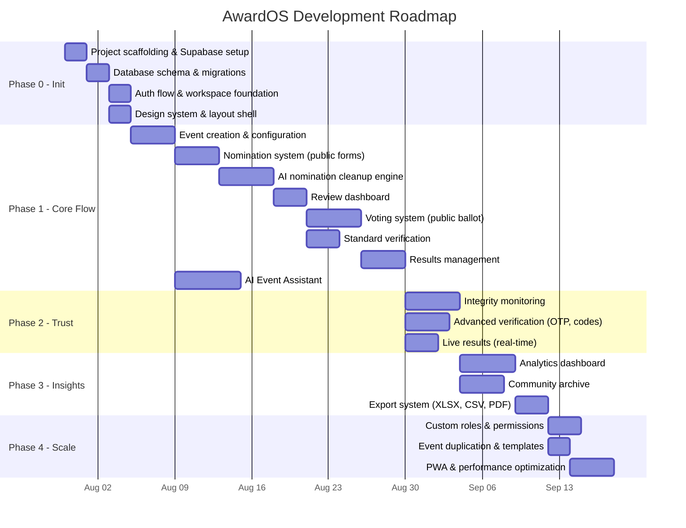

# AwardOS — Implementation Plan & Roadmap

> **Superseded historical roadmap.** This proposal predates the verified
> production-readiness release. It is retained for traceability, not execution.
> Use `docs/product/PRODUCT.md` for current product status and priorities.

**Version:** 1.0
**Date:** July 29, 2026
**Status:** Awaiting Approval

---

## Architecture Decisions (Locked In)

Based on our discussion, here are the finalized technology choices:

| Decision | Choice | Rationale |
|---|---|---|
| **Frontend** | Next.js 15 (App Router) + TypeScript | SSR for public pages (SEO), API routes for backend, one codebase |
| **Styling** | Tailwind CSS 4 + shadcn/ui | Rapid UI development, accessible components, dark mode built-in |
| **Database** | Supabase (PostgreSQL) | Managed Postgres with RLS, real-time subscriptions, and integrated auth |
| **Auth** | Supabase Auth | Email/password + Google SSO + magic links, free tier covers MVP |
| **File Storage** | Supabase Storage | Integrated with auth, RLS-protected buckets for branding assets |
| **Real-time** | Supabase Realtime | WebSocket-based live updates for results, nomination counters |
| **AI Strategy** | Multi-provider (user brings their own key) | Support Gemini, OpenAI, Anthropic — user selects provider and enters API key in settings |
| **AI SDK** | Vercel AI SDK | Provider-agnostic abstraction layer, streaming support, Next.js native |
| **ORM** | Drizzle ORM | Type-safe, lightweight, works great with Supabase Postgres |
| **Deployment** | Vercel | Auto-deploy from Git, edge functions, preview deployments |
| **Mobile** | Responsive web (PWA) for Phase 1 | React Native planned for future phases |
| **Multi-tenancy** | Yes, from day one | Workspace-scoped data, RLS policies, no billing in Phase 1 |

---

## Phased Roadmap



---

### Phase 0 — Initialization (Sprint 0) · ~1 week

> [!IMPORTANT]
> This is what the `/goal` command will execute first. Everything below must be complete before Phase 1 begins.

| Step | Task | Details |
|---|---|---|
| 0.1 | **Create Supabase project** | Guide you through creating a project, getting the URL + anon key + service role key |
| 0.2 | **Scaffold Next.js app** | `npx -y create-next-app@latest ./` with App Router, TypeScript, Tailwind CSS, ESLint |
| 0.3 | **Install core dependencies** | `@supabase/supabase-js`, `@supabase/ssr`, `drizzle-orm`, `drizzle-kit`, `ai`, `@ai-sdk/openai`, `@ai-sdk/google`, `@ai-sdk/anthropic`, `shadcn/ui`, `lucide-react`, `zod`, `date-fns` |
| 0.4 | **Configure environment variables** | `.env.local` template with Supabase keys, AI provider keys (optional) |
| 0.5 | **Set up Drizzle ORM** | Schema definitions matching PRD data models, migration config |
| 0.6 | **Run database migrations** | Create all 25+ tables, indexes, enums, and RLS policies |
| 0.7 | **Configure Supabase Auth** | Enable email/password + Google OAuth provider, set redirect URLs |
| 0.8 | **Set up Supabase Storage** | Create buckets: `event-branding`, `nominee-photos`, `exports` |
| 0.9 | **Build auth middleware** | Next.js middleware for protected routes, session refresh |
| 0.10 | **Create app layout shell** | Root layout, dashboard layout (sidebar + header), public layout |
| 0.11 | **Set up design system** | shadcn/ui components, theme tokens, typography, color palette |
| 0.12 | **Build sign-up / sign-in pages** | Email + Google SSO, email verification flow |
| 0.13 | **Build workspace creation** | Auto-create Personal Workspace on first sign-in |
| 0.14 | **Set up Vercel project** | Connect Git repo, configure env vars, first deployment |
| 0.15 | **Seed data script** | Dev-only script to populate test data for development |

---

### Phase 1 — Core Flow · ~5 weeks

The complete nomination-to-results pipeline + AI assistant.

#### 1A. Event Creation & Configuration

| Feature | Files/Routes | Details |
|---|---|---|
| Event CRUD | `/dashboard/events`, `/dashboard/events/new`, `/dashboard/events/[id]` | Create, edit, delete events with name, description, status, visibility |
| Category management | `/dashboard/events/[id]/categories` | Add/remove/reorder categories with drag-and-drop |
| Workflow configuration | `/dashboard/events/[id]/workflow` | Visual pipeline editor with drag-and-drop stage reordering |
| Branding uploads | `/dashboard/events/[id]/branding` | Logo, banner, flyer, colors — stored in Supabase Storage |
| Event settings | `/dashboard/events/[id]/settings` | Verification level, audience, live results mode, scheduling |
| Public event page | `/e/[slug]` | Branded landing page showing event info, timeline, current stage |
| Event preview | `/dashboard/events/[id]/preview` | Organizer preview of public page |

#### 1B. Nomination System

| Feature | Files/Routes | Details |
|---|---|---|
| Public nomination form | `/e/[slug]/nominate` | Guest-accessible form, multi-category, no auth required |
| Nomination API | `/api/public/events/[slug]/nominations` | Accept submissions, store with session tracking |
| Suggested categories | Inline in nomination form | Free-text field stored separately |
| Suggested Categories Inbox | `/dashboard/events/[id]/suggested-categories` | Review, approve, reject, merge, rename |
| Nomination counter | Real-time on dashboard | Supabase Realtime subscription per category |
| Local persistence | Client-side `localStorage` | Remember previous submissions, show "already submitted" banner |
| Confirmation screen | Post-submission UI | Summary of submitted nominations + share CTA |

#### 1C. AI Nomination Cleanup

| Feature | Details |
|---|---|
| Cleanup trigger | One-click button on dashboard → calls server action |
| Blank removal | Server-side filter: empty, whitespace-only, special-char-only entries |
| Duplicate detection | Fuzzy matching with Jaro-Winkler + Levenshtein + LLM-assisted nickname resolution |
| Capitalization normalization | Title Case with edge case handling (Mc, Mac, O', van, de) |
| Confidence scoring | 0–100 per suggestion; tiered: High ≥85, Medium 60–84, Low <60 |
| Review interface | Side-by-side merge UI with approve/reject/edit per suggestion |
| Batch operations | Select multiple → bulk approve/reject |
| Undo merge | Restore original records within review phase |
| Audit trail | Log every AI suggestion + organizer decision |

#### 1D. Review Dashboard

| Feature | Details |
|---|---|
| Nominee management | Add, remove, merge, rename, reorder (drag-and-drop) |
| Category management | Add, remove, rename, reorder |
| Move nominee | Drag nominee between categories |
| Generate ballot | One-click ballot generation from reviewed nominees |
| Manual ballot creation | Create ballot from scratch (skip nominations) |
| Ballot preview | See exactly what voters will see |

#### 1E. Voting System

| Feature | Files/Routes | Details |
|---|---|---|
| Public ballot | `/e/[slug]/vote` | Guest-accessible, per-category voting with skip option |
| Vote confirmation | Pre-submit review page | Highlights skipped categories |
| Vote submission | `/api/public/events/[slug]/votes` | Write-once, immutable after submission |
| Thank you page | Post-submit | Confirmation + social sharing buttons |
| Standard verification | Middleware | Cookies + localStorage + IP rate limiting + device fingerprint |
| Grace window | Server-side | 15-minute buffer after deadline for in-progress ballots |

#### 1F. Results Management

| Feature | Details |
|---|---|
| Raw results | Auto-generated from votes; immutable; audit trail |
| Official results | Editable copy: disqualify, override rank, remove votes, add explanation |
| Special awards | Create awards outside voting (e.g., Lifetime Achievement) |
| Publish / unpublish | Publish to public page; unpublish with "under review" notice |
| Public results page | `/e/[slug]/results` — branded, shareable |

#### 1G. AI Event Assistant

| Feature | Details |
|---|---|
| Chat interface | Slide-out panel embedded in event dashboard |
| Context injection | Event metadata, categories, aggregated nominations, workflow state sent as system context |
| Multi-provider support | User selects provider (Gemini/OpenAI/Anthropic) and enters API key in settings |
| Content generation | Descriptions, social posts, MC scripts, eligibility rules |
| Data summarization | Natural language summaries of nominations and voting |
| Copy/insert actions | Copy to clipboard or insert directly into event fields |

---

### Phase 2 — Intelligence & Trust · ~3 weeks

| Feature | Details |
|---|---|
| **Integrity monitoring** | Spike detection, fingerprint analysis, IP clustering, bot detection |
| **Integrity dashboard** | Unified alert view with severity levels, drill-down, resolve/dismiss |
| **Advanced verification: Email OTP** | 6-digit code, 5-min expiry, domain whitelisting |
| **Advanced verification: Invitation codes** | Generate N codes, single-use, track usage |
| **Live results** | Real-time leaderboard via Supabase Realtime; configurable visibility modes |

---

### Phase 3 — Insights & Archive · ~3 weeks

| Feature | Details |
|---|---|
| **Analytics dashboard** | Participation overview, category analytics, engagement timeline, traffic sources |
| **Demographic segmentation** | Breakdowns by department/faculty (where eligibility data exists) |
| **Community archive** | Auto-archive on publish; configurable privacy; browsable public archive |
| **Export system** | XLSX (via SheetJS), CSV, PDF (via @react-pdf/renderer); async for large datasets |

---

### Phase 4 — Scale & Polish · Ongoing

| Feature | Details |
|---|---|
| **Custom roles** | Create roles with granular permissions from permission catalogue |
| **Event duplication** | Deep-copy events as templates |
| **Comparative analytics** | Year-over-year comparison when previous events exist |
| **PWA manifest** | Installable web app with offline support for critical pages |
| **Performance optimization** | Image optimization, lazy loading, code splitting, edge caching |
| **Workspace invite improvements** | Expiry dates, max use counts, domain restrictions on invite links |

---

## Project Structure

```
awardos/
├── .env.local                    # Environment variables (gitignored)
├── .env.example                  # Template for env vars
├── next.config.ts
├── tailwind.config.ts
├── drizzle.config.ts
├── package.json
├── tsconfig.json
│
├── public/
│   ├── favicon.ico
│   └── og-default.png
│
├── src/
│   ├── app/                      # Next.js App Router
│   │   ├── layout.tsx            # Root layout (fonts, theme)
│   │   ├── page.tsx              # Landing page
│   │   ├── globals.css
│   │   │
│   │   ├── (auth)/               # Auth route group
│   │   │   ├── sign-in/page.tsx
│   │   │   ├── sign-up/page.tsx
│   │   │   ├── verify-email/page.tsx
│   │   │   └── layout.tsx
│   │   │
│   │   ├── (dashboard)/          # Authenticated route group
│   │   │   ├── layout.tsx        # Sidebar + header layout
│   │   │   ├── dashboard/
│   │   │   │   └── page.tsx      # Workspace overview
│   │   │   ├── events/
│   │   │   │   ├── page.tsx      # Events list
│   │   │   │   ├── new/page.tsx
│   │   │   │   └── [id]/
│   │   │   │       ├── page.tsx          # Event overview
│   │   │   │       ├── categories/page.tsx
│   │   │   │       ├── workflow/page.tsx
│   │   │   │       ├── branding/page.tsx
│   │   │   │       ├── settings/page.tsx
│   │   │   │       ├── nominations/page.tsx
│   │   │   │       ├── suggested-categories/page.tsx
│   │   │   │       ├── ai-cleanup/page.tsx
│   │   │   │       ├── review/page.tsx
│   │   │   │       ├── voting/page.tsx
│   │   │   │       ├── integrity/page.tsx
│   │   │   │       ├── results/page.tsx
│   │   │   │       ├── analytics/page.tsx
│   │   │   │       ├── assistant/page.tsx
│   │   │   │       ├── export/page.tsx
│   │   │   │       └── archive/page.tsx
│   │   │   ├── settings/
│   │   │   │   ├── page.tsx      # Workspace settings
│   │   │   │   ├── members/page.tsx
│   │   │   │   └── ai/page.tsx   # AI provider settings
│   │   │   └── profile/page.tsx
│   │   │
│   │   ├── e/                    # Public event routes
│   │   │   └── [slug]/
│   │   │       ├── page.tsx      # Event landing page
│   │   │       ├── nominate/page.tsx
│   │   │       ├── vote/page.tsx
│   │   │       ├── results/page.tsx
│   │   │       └── live/page.tsx
│   │   │
│   │   ├── archive/              # Public archive
│   │   │   ├── page.tsx
│   │   │   └── [slug]/page.tsx
│   │   │
│   │   └── api/                  # API routes
│   │       ├── auth/
│   │       │   └── callback/route.ts
│   │       ├── public/
│   │       │   └── events/
│   │       │       └── [slug]/
│   │       │           ├── nominations/route.ts
│   │       │           ├── votes/route.ts
│   │       │           ├── verify/route.ts
│   │       │           └── live-results/route.ts
│   │       ├── events/
│   │       │   └── [id]/
│   │       │       ├── ai-cleanup/route.ts
│   │       │       ├── assistant/route.ts
│   │       │       ├── export/route.ts
│   │       │       └── results/route.ts
│   │       └── webhooks/
│   │           └── supabase/route.ts
│   │
│   ├── components/               # Shared UI components
│   │   ├── ui/                   # shadcn/ui primitives
│   │   ├── layout/               # Sidebar, Header, Footer
│   │   ├── events/               # Event-specific components
│   │   ├── nominations/          # Nomination form, review UI
│   │   ├── voting/               # Ballot, confirmation
│   │   ├── ai/                   # Chat panel, merge review
│   │   ├── analytics/            # Charts, metrics cards
│   │   └── shared/               # Logos, loading states, etc.
│   │
│   ├── lib/                      # Core utilities
│   │   ├── supabase/
│   │   │   ├── client.ts         # Browser client
│   │   │   ├── server.ts         # Server client
│   │   │   ├── middleware.ts     # Auth middleware helper
│   │   │   └── admin.ts          # Service role client
│   │   ├── ai/
│   │   │   ├── provider.ts       # Multi-provider factory
│   │   │   ├── cleanup.ts        # Nomination cleanup logic
│   │   │   ├── assistant.ts      # Event assistant logic
│   │   │   └── integrity.ts      # Voting integrity analysis
│   │   ├── db/
│   │   │   ├── schema/           # Drizzle schema files
│   │   │   │   ├── users.ts
│   │   │   │   ├── workspaces.ts
│   │   │   │   ├── events.ts
│   │   │   │   ├── categories.ts
│   │   │   │   ├── nominees.ts
│   │   │   │   ├── nominations.ts
│   │   │   │   ├── votes.ts
│   │   │   │   ├── ai-cleanup.ts
│   │   │   │   ├── integrity.ts
│   │   │   │   ├── results.ts
│   │   │   │   └── index.ts      # Re-exports all schemas
│   │   │   ├── migrations/       # Generated SQL migrations
│   │   │   └── index.ts          # Drizzle client instance
│   │   ├── verification/
│   │   │   ├── standard.ts       # Cookie/IP/fingerprint checks
│   │   │   ├── otp.ts            # Email OTP logic
│   │   │   └── invitation.ts     # Invitation code logic
│   │   ├── export/
│   │   │   ├── xlsx.ts
│   │   │   ├── csv.ts
│   │   │   └── pdf.ts
│   │   ├── utils.ts              # General utilities
│   │   ├── constants.ts          # App-wide constants
│   │   └── validators.ts         # Zod schemas for forms/API
│   │
│   ├── hooks/                    # Custom React hooks
│   │   ├── use-workspace.ts
│   │   ├── use-event.ts
│   │   ├── use-realtime.ts
│   │   └── use-ai-provider.ts
│   │
│   ├── actions/                  # Next.js Server Actions
│   │   ├── auth.ts
│   │   ├── workspaces.ts
│   │   ├── events.ts
│   │   ├── categories.ts
│   │   ├── nominees.ts
│   │   ├── nominations.ts
│   │   ├── voting.ts
│   │   ├── results.ts
│   │   └── ai.ts
│   │
│   ├── types/                    # TypeScript type definitions
│   │   ├── database.ts           # Generated from Drizzle schema
│   │   ├── api.ts                # API request/response types
│   │   └── enums.ts              # Shared enums
│   │
│   └── middleware.ts             # Next.js middleware (auth, redirects)
│
├── supabase/
│   ├── config.toml               # Supabase local dev config
│   ├── migrations/               # SQL migration files
│   └── seed.sql                  # Development seed data
│
└── scripts/
    └── seed.ts                   # TypeScript seed script
```

---

## Database Migration Plan

Migrations will be created in this order, respecting foreign key dependencies:

| Migration | Tables | Dependencies |
|---|---|---|
| `001_auth_and_users.sql` | `users` (extends Supabase auth.users), profiles | None |
| `002_workspaces.sql` | `workspaces`, `workspace_members`, `custom_roles` | users |
| `003_events.sql` | `events`, `event_branding`, `workflow_stages` | workspaces |
| `004_categories_and_nominees.sql` | `categories`, `nominees`, `nominations`, `suggested_categories` | events |
| `005_voting.sql` | `vote_sessions`, `votes`, `invitation_codes` | events, categories, nominees |
| `006_ai_and_integrity.sql` | `ai_cleanup_tasks`, `ai_merge_suggestions`, `integrity_alerts`, `ai_conversations`, `ai_messages` | events, categories, nominees |
| `007_results_and_exports.sql` | `official_results`, `result_actions`, `special_awards`, `archive_configs`, `export_jobs`, `audit_logs` | events, categories, nominees |

---

## Prerequisites Before Starting

> [!WARNING]
> You'll need to complete these steps before I can begin the initialization. I'll guide you through each one.

| # | Prerequisite | Time | Status |
|---|---|---|---|
| 1 | **Create a Supabase account** at [supabase.com](https://supabase.com) | 2 min | ⬜ |
| 2 | **Create a new Supabase project** (I'll guide you through settings) | 3 min | ⬜ |
| 3 | **Get your Supabase keys**: Project URL, anon key, service role key | 1 min | ⬜ |
| 4 | **Get at least one AI API key** (Gemini, OpenAI, or Anthropic) for testing | 5 min | ⬜ |
| 5 | **Ensure Node.js 18+** is installed (`node --version`) | 1 min | ⬜ |
| 6 | **(Optional) Create a Vercel account** for deployment | 2 min | ⬜ |

---

## Estimated Timeline

| Phase | Duration | Deliverable |
|---|---|---|
| **Phase 0** — Initialization | ~1 week | Running app with auth, workspace, and design system |
| **Phase 1** — Core Flow | ~5 weeks | Complete nomination → voting → results pipeline + AI assistant |
| **Phase 2** — Trust & Intelligence | ~3 weeks | Integrity monitoring, advanced verification, live results |
| **Phase 3** — Insights & Archive | ~3 weeks | Analytics, archive, export |
| **Phase 4** — Scale & Polish | Ongoing | Custom roles, templates, PWA, performance |
| | | |
| **Total to production-ready MVP** | **~12 weeks** | Phases 0–3 complete |

---

## What `/goal` Will Execute

When you approve this plan, I will use the `/goal` command to execute **Phase 0 (Initialization)** end-to-end:

1. Scaffold the Next.js project in your workspace
2. Install all dependencies
3. Set up the project structure shown above
4. Create the Drizzle schema files matching the PRD data models
5. Generate and run database migrations
6. Configure Supabase Auth (email + Google SSO)
7. Build the auth pages (sign-in, sign-up, verify email)
8. Create the dashboard layout shell (sidebar, header, navigation)
9. Set up the design system (shadcn/ui components, theme)
10. Build the workspace creation flow (auto-create on first sign-in)
11. Create the AI provider settings page (multi-provider key management)
12. Deploy to Vercel
13. Create a dev seed script for testing

After Phase 0, we'll proceed through Phases 1–3 iteratively.

> [!IMPORTANT]
> **Please review this plan and confirm:**
> 1. Does the project structure make sense?
> 2. Are you comfortable with the phasing order?
> 3. Are you ready to set up Supabase and get your keys, or do you want me to walk you through it first?
>
> Once approved, I'll start building.
